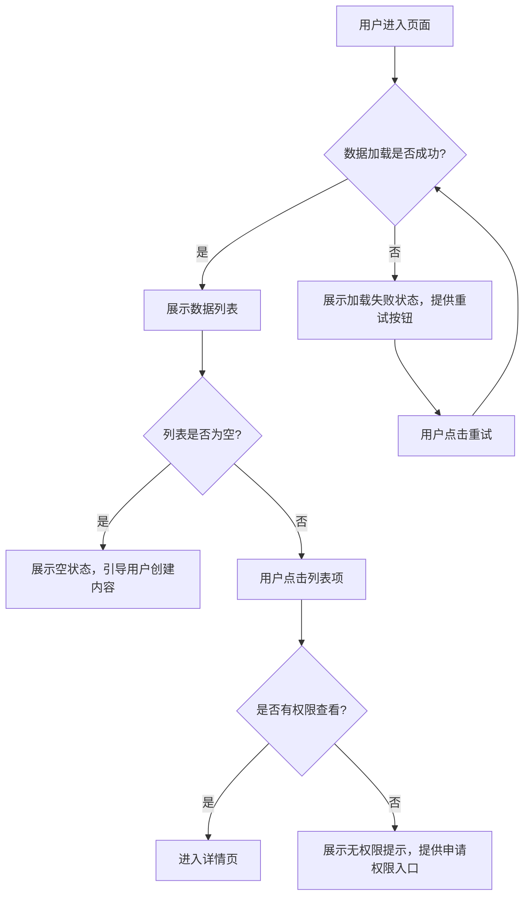

# 用户体验设计技能

> 聚焦用户体验全流程设计，确保产品易用、好用、爱用，降低用户学习成本和使用摩擦

## 核心能力
### 1. 体验设计框架
- **用户旅程地图**：端到端用户体验梳理，识别接触点、痛点、爽点
- **信息架构设计**：产品导航结构、内容组织方式，确保用户容易找到需要的功能
- **交互流程设计**：主流程、异常流程、逆向操作流程设计，确保逻辑闭环
- **状态设计**：空状态、加载状态、错误状态、成功状态的统一设计规范

### 2. 体验优化原则
- **尼尔森十大可用性原则**：状态可见、环境贴切、用户可控、一致性、防错、易识别、灵活高效、美观简约、容错、帮助文档
- **奥卡姆剃刀原则**：如无必要，勿增实体，最小化用户认知负担
- **渐进式披露**：复杂功能分层展示，避免一次性给用户太多信息

### 3. 异常处理设计
- **错误提示设计**：清晰说明问题、解释原因、提供解决方案
- **逃生通道设计**：每个操作都有返回/取消/撤销的途径
- **降级方案设计**：网络异常、服务不可用时的优雅降级体验

## 输出模板
### 用户旅程地图模板
```
【用户旅程地图】

**用户角色**：[角色名称]
**核心目标**：[用户要完成的核心任务]

| 阶段 | 接触点 | 用户行为 | 痛点 | 爽点 | 机会点 |
|------|--------|---------|------|------|--------|
| 发现阶段 | 广告、搜索结果 | 用户搜索相关关键词，点击广告 | 广告信息不明确，找不到想要的内容 | 精准匹配需求的结果 | 优化搜索关键词和 landing page 内容 |
| 决策阶段 | 产品详情页、评价 | 用户查看功能介绍、价格、其他用户评价 | 信息不全，担心不好用 | 真实可信的评价，清晰的功能演示 | 增加用户案例、演示视频、免费试用入口 |
| 使用阶段 | 注册、引导、核心功能 | 用户注册账号，完成新手引导，使用核心功能 | 注册流程复杂，引导看不懂 | 流畅的体验，快速感受到价值 | 简化注册流程，提供上下文引导 |
| 留存阶段 | 消息推送、更新通知 | 用户收到产品更新、活动推送 | 推送太频繁，内容不相关 | 有价值的个性化推送 | 优化推送策略，基于用户行为个性化推荐 |
```

### 交互流程图模板


### 状态设计规范模板
```
【状态设计规范】

**空状态**：
- 图标：[统一图标]
- 文案："还没有内容哦，点击按钮创建第一个吧"
- 操作按钮：[明确的行动召唤按钮]

**加载状态**：
- 骨架屏：[统一的骨架屏样式]
- 文案："加载中..."
- 超时处理：10秒未加载完成展示失败状态

**错误状态**：
- 图标：[统一错误图标]
- 文案："加载失败了，请检查网络后重试"
- 操作：提供重试按钮，10秒后自动重试
```
